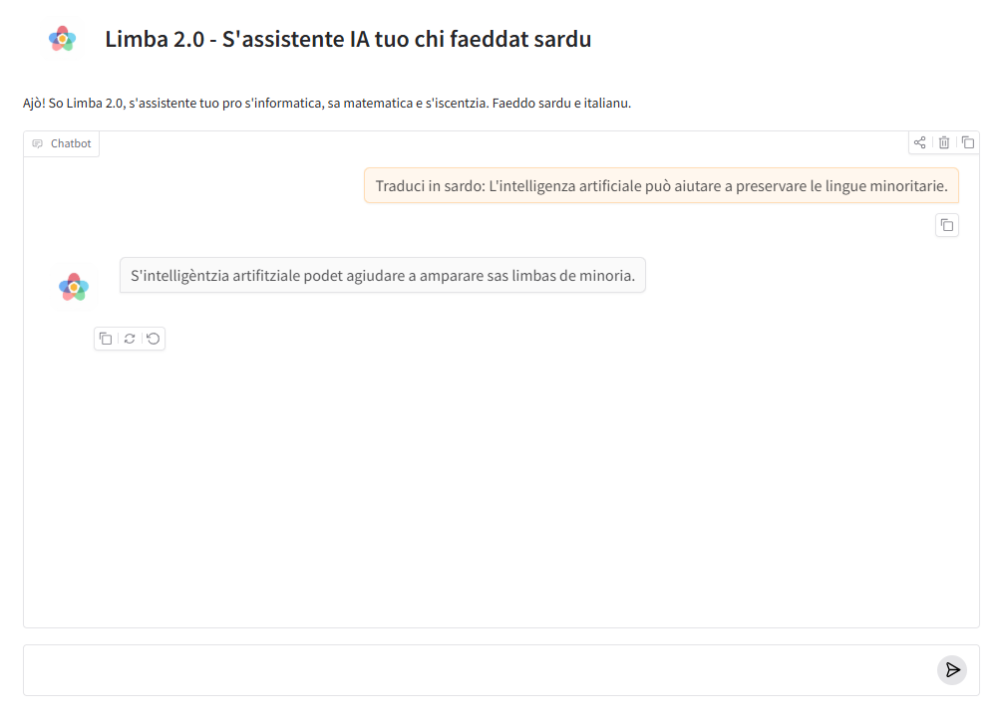

# LIMBA — Sardinian Language Model
[](https://github.com/francesco-palladino/LIMBA-Sardinian-Language-Model/actions/workflows/validate-dataset.yml)

LIMBA is a fine-tuned Llama 3.1 language model designed to work with Italian and Limba Sarda Comuna (LSC).

The model supports:

- Italian → Limba Sarda Comuna translation
- Limba Sarda Comuna → Italian translation
- Sardinian text generation
- Conversational interaction
- Educational and linguistic applications
- NLP experimentation for a minority language

LIMBA was developed as an experimental project focused on Sardinian language technologies, language preservation and accessible AI applications.


## Model and demo

The LIMBA model is hosted on Hugging Face:

[View the LIMBA model on Hugging Face](https://huggingface.co/FPll/limba-mentor-llama3-gguf)

An interactive demo is available through Hugging Face Spaces:

[Try the LIMBA interactive demo](https://huggingface.co/spaces/FPll/Limba_2.0)

This GitHub repository contains the project documentation, training workflow, code, dataset samples, evaluation materials and usage examples.


## Demo Preview

[](https://huggingface.co/spaces/FPll/Limba_2.0)

*LIMBA 2.0 running on Hugging Face Spaces. Click the image to open the interactive demo.*


## Project Overview

LIMBA was created to explore how Large Language Models can be adapted to support a low-resource language through parameter-efficient fine-tuning.

The project focuses on Limba Sarda Comuna (LSC), providing conversational capabilities, bidirectional translation between Italian and Sardinian, and natural language generation while preserving linguistic consistency.

Beyond building a functional assistant, the project investigates practical workflows for dataset creation, instruction tuning, prompt engineering and evaluation in multilingual and minority-language NLP.

LIMBA also serves as an educational case study demonstrating the complete lifecycle of a fine-tuned LLM, from dataset preparation to deployment on Hugging Face.


## Features

| Feature | Status |
|---------|:------:|
| Italian → Limba Sarda Comuna (LSC) Translation | ✅ |
| Limba Sarda Comuna (LSC) → Italian Translation | ✅ |
| Conversational AI | ✅ |
| Sardinian Text Generation | ✅ |
| Fine-tuned Llama 3.1 | ✅ |
| Parameter-Efficient Fine-Tuning (LoRA) | ✅ |
| Unsloth Training Pipeline | ✅ |
| GGUF Export | ✅ |
| Hugging Face Model | ✅ |
| Hugging Face Spaces Demo | ✅ |


## Technical Architecture

| Component | Technology |
|----------|------------|
| Base Model | Meta Llama 3.1 |
| Fine-Tuning | LoRA (Low-Rank Adaptation) |
| Training Framework | Unsloth |
| Inference Format | GGUF |
| Interface | Gradio |

## Training Pipeline

LIMBA was fine-tuned using a parameter-efficient training workflow based on Unsloth and LoRA.

### Main configuration

| Parameter | Value |
|---|---|
| Base model | Meta Llama 3.1 8B |
| Training framework | Unsloth |
| Fine-tuning method | LoRA |
| Quantized loading | 4-bit |
| Context length | 4096 tokens |
| LoRA rank | 32 |
| LoRA alpha | 64 |
| Training epochs | 3 |
| Learning rate | 2e-4 |
| Optimizer | AdamW 8-bit |
| Export format | GGUF Q4_K_M |

### Workflow

1. Load the quantized base model.
2. Configure LoRA adapters.
3. Prepare and format the instruction dataset.
4. Fine-tune the model with supervised training.
5. Test the model before and after fine-tuning.
6. Export the trained model to GGUF format.
7. Publish the model on Hugging Face Hub.
8. Deploy the conversational interface through Hugging Face Spaces.
| Deployment | Hugging Face Spaces |
| Model Repository | Hugging Face Hub |
| Primary Language | Limba Sarda Comuna (LSC) |
| Secondary Language | Italian |

## Try LIMBA

### Interactive demo

LIMBA can be tested directly through its Hugging Face Spaces interface:

[Launch the LIMBA 2.0 interactive demo](https://huggingface.co/spaces/FPll/Limba_2.0)

The demo provides:

- conversational interaction in Italian and Limba Sarda Comuna;
- Italian–Sardinian translation;
- Sardinian text generation;
- educational explanations;
- basic programming assistance;
- lightweight retrieval from Sardinian and Italian Wikipedia.

### Model repository

The quantized GGUF model is available on Hugging Face Hub:

[View the LIMBA model repository](https://huggingface.co/FPll/limba-mentor-llama3-gguf)

### Repository contents

This GitHub repository includes:

- the public training notebook;
- the Gradio inference application;
- runtime and training dependencies;
- a curated dataset sample;
- training methodology;
- example prompts;
- technical and deployment documentation.


## Local Inference

LIMBA can be run locally through the command-line inference script included in this repository.

### Requirements

- Python 3.10 or later
- Enough RAM to load the quantized 8B GGUF model
- Internet access during the first run to download the model from Hugging Face Hub

### Installation

Clone the repository:

```bash
git clone https://github.com/FPll/LIMBA-Sardinian-Language-Model.git
cd LIMBA-Sardinian-Language-Model
```

Create and activate a virtual environment:

```bash
python -m venv .venv
```

On Windows:

```bash
.venv\Scripts\activate
```

On Linux or macOS:

```bash
source .venv/bin/activate
```

Install the runtime dependencies:

```bash
pip install -r requirements.txt
```

### Run LIMBA

```bash
python inference.py --prompt "Traduci in sardo: La tecnologia può aiutare a preservare le lingue minoritarie."
```

Optional generation parameters:

```bash
python inference.py \
  --prompt "Scrivi un breve testo in LSC sulla tutela dell'ambiente." \
  --max-tokens 512 \
  --temperature 0.1 \
  --context-length 4096 \
  --threads 4
```

The model is downloaded automatically from the LIMBA repository on Hugging Face Hub during the first execution.

### Hugging Face authentication

The public GGUF model normally does not require authentication. If authentication is needed, define the `HF_TOKEN` environment variable before running the script.

Never store Hugging Face tokens directly inside source-code files or notebooks.


## Dataset Quality Assurance

The repository includes a validation utility for checking instruction-tuning datasets before training.

The script verifies:

- JSONL syntax;
- required `instruction`, `context` and `response` fields;
- correct data types;
- empty instructions or responses;
- unexpected fields;
- leading or trailing spaces;
- duplicate instruction–response pairs.

Run the validator with:

```bash
python scripts/validate_dataset.py data/sample_dataset.jsonl
```

A successful validation returns:

```text
Records checked: 60
Dataset validation completed successfully.
```

This validation step supports dataset consistency, reproducibility and quality control throughout the fine-tuning workflow.
